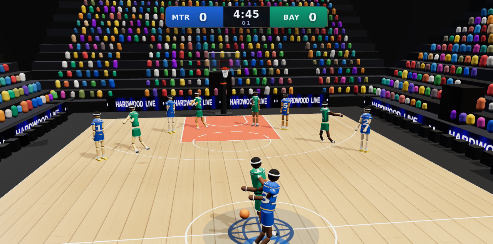

# 🏀 Full Court — 3D Basketball

A real-time **3D basketball game that runs entirely in the browser**, built from
scratch on [Three.js](https://threejs.org). Broadcast-style arena, physically
simulated ball and shooting, five-on-five gameplay against the AI, a live
NBA-style scoreboard, and a fully procedural presentation — no build step, no
external assets, no network required.



## Play

It's a static site — just serve the folder over HTTP and open it:

```bash
# any static server works, e.g.
python3 -m http.server 8000
# then open http://localhost:8000
```

> It must be served over `http(s)://` (not opened as a `file://` path) because it
> uses ES modules and an import map. Any modern desktop or mobile browser with
> WebGL2 works.

## Controls

| Input | Action |
| --- | --- |
| **WASD / Arrows** | Move (camera-relative) |
| **Hold Space** | Shoot — release inside the green window of the shot meter |
| **Shift** | Sprint |
| **E** | Pass to the best open teammate |
| **Q** | Steal (on defense) |
| **Space** (no ball) | Contest / block a shot |
| **F** | Switch controlled player (on defense) |
| **C** | Toggle broadcast / follow camera |
| **P / Esc** | Pause |

You always control one player (highlighted by a ring). On offense you take over
the ball-handler automatically; on defense you control the nearest defender.
Gamepad and touch controls are supported too.

## Features

- **Full 3D arena** — hardwood court with regulation NBA markings, glass
  backboards, breakaway-style nets, a packed animated crowd (thousands of
  instanced spectators), a hanging jumbotron, scrolling LED ad boards, and a
  lighting rig with real-time soft shadows.
- **Simulated ball physics** — gravity, air drag, and collisions with the floor,
  rim (torus), backboard and net, with sub-stepping so fast shots never tunnel.
  Makes and misses are decided by the simulation, not scripted.
- **Shot-meter shooting** — timing-based release with perfect / good / late
  windows; accuracy also depends on distance, contest, and range.
- **Five-on-five AI** — ball-handler decision making (drive / shoot / pass),
  off-ball spacing, man-to-man defense with help, steals, blocks and rebounds,
  across three difficulty levels.
- **Full game flow** — tip-off, 24-second shot clock, game clock, four quarters,
  halftime, overtime, and a final scoreboard. Rematch or return to the menu.
- **Broadcast presentation** — a tracking broadcast camera plus an over-the-
  shoulder follow cam, an NBA-style scorebug, announcements, and fully
  procedural audio (dribbles, swishes, rim clangs, whistle, buzzer, crowd).

## Tech

- **Three.js r161**, vendored locally in `vendor/` — the game is 100% offline and
  has zero runtime dependencies.
- Plain ES modules, no bundler, no framework. Open `index.html` and go.
- All art (court, arena, players, textures) is generated procedurally at runtime.

## Project layout

```
index.html            entry point (import map + HUD/menu DOM)
styles.css            HUD, menus, shot meter
vendor/three.module.js  vendored Three.js r161
src/
  config/Constants.js   single source of truth (dimensions, colors, rules)
  engine/               Renderer, Input, Audio
  world/                Court, Hoop, Arena, Lighting
  entities/             Ball, Player (articulated, animated)
  systems/              Physics, Shooting, Locomotion, PlayerController, AI,
                        CameraRig, GameState (match director)
  main.js               bootstrap + game loop
```

## Notes

Team names, colors and city names are original and fictional — this is not
affiliated with or endorsed by the NBA or any real team. It aims for the *feel*
of a broadcast basketball game within what a browser can render in real time.
